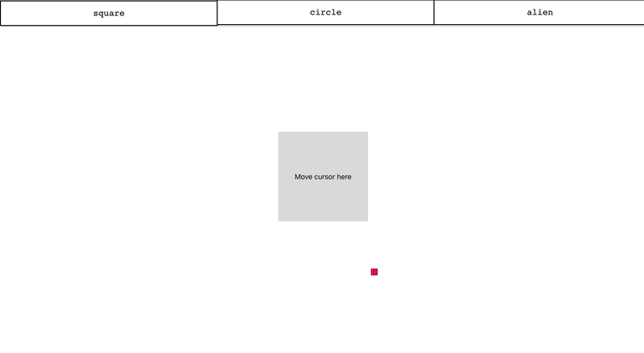

# react-smooth-cursor

> Smooth cursor library

<div align="center">
    
</div>

[](https://www.npmjs.com/package/react-smooth-cursor) [](https://standardjs.com)

## Install
```bash
yarn add react-smooth-cursor
```

or

```bash
npm install react-smooth-cursor
```

## Usage

```tsx
import React, { Component } from 'react'

import SmoothCursor from 'react-smooth-cursor'
import 'react-smooth-cursor/dist/index.css'

class Example extends Component {
  render() {
    return
      <SmoothCursor
        // Required
        bindClasses={['animateOnClassName']}

        // Optionals
        fillColor='#e20c6a'
        strokeColor='#000'
        strokeWidth={1}
        cursorRadius={25}
      />
  }
}

// or

const Example = ()=> {
  return
      <SmoothCursor
        // Required
        bindClasses={['animateOnClassName']}

        // Optionals
        fillColor='#e20c6a'
        strokeColor='#000'
        strokeWidth={1}
        cursorRadius={25}
      />;
}
```

## License

MIT © [mustafademirtas](https://github.com/mustafademirtas)
